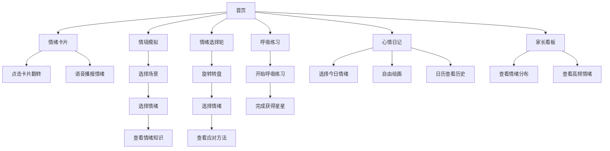

## 1. 产品概述

儿童情绪认知与管理平台，旨在帮助3-8岁儿童认识、理解和管理自己的情绪。通过卡通互动、游戏化练习和亲子互动，培养儿童的情绪智力。
- 目标用户：3-8岁儿童及其家长
- 核心价值：让孩子在游戏中学会识别情绪、表达情绪、管理情绪

## 2. 核心功能

### 2.1 用户角色
| 角色 | 使用方式 | 核心功能 |
|------|----------|----------|
| 儿童用户 | 直接使用App | 情绪认知、情境模拟、呼吸练习、心情日记 |
| 家长用户 | 家长看板 | 查看孩子情绪数据 |

### 2.2 功能模块
1. **首页导航**：功能入口卡片、快速进入各模块
2. **情绪卡片**：6种基础情绪展示与互动
3. **情境模拟**：日常场景情绪学习
4. **情绪选择轮**：情绪转盘与应对方法
5. **呼吸练习**：引导式深呼吸训练
6. **心情日记**：每日情绪记录与绘画
7. **家长看板**：情绪数据统计与分析

### 2.3 页面详情
| 页面名称 | 模块名称 | 功能描述 |
|-----------|-----------|----------------|
| 首页 | 导航卡片 | 6大功能模块入口卡片，带动画效果 |
| 情绪卡片页 | 情绪卡片翻转 | 正面卡通表情，点击翻转显示情绪名称语音播报，背面情绪小贴士 |
| 情绪卡片页 | 表情模仿 | 鼓励孩子模仿卡片表情，点击播放情绪名称 |
| 情境模拟页 | 场景展示 | 图文展示日常场景，提供情绪选择按钮 |
| 情境模拟页 | 情绪反馈 | 选择后展示该场景常见情绪反应小知识 |
| 情绪选择轮页 | 可旋转转盘 | 点击选择当前情绪 |
| 情绪选择轮页 | 应对方法 | 选择情绪后展示3个简单应对方法 |
| 呼吸练习页 | 呼吸动画 | 圆球缩放动画引导呼吸（吸气放大/呼气缩小） |
| 呼吸练习页 | 计时引导 | 4-2-6呼吸法，完成后奖励星星 |
| 心情日记页 | 情绪选择 | 每日一次情绪记录 |
| 心情日记页 | 绘画画板 | 简单颜色/笔触自由绘画 |
| 心情日记页 | 日历视图 | 查看历史情绪记录 |
| 家长看板页 | 情绪分布图 | 近7天情绪分布柱状图（ECharts） |
| 家长看板页 | 高频情绪Top3 | 高频情绪标注 |
| 家长看板页 | 当日概览 | 当日情绪记录概览 |

## 3. 核心流程

## 4. 用户界面设计

### 4.1 设计风格
- 主色调：温暖柔和的糖果色系（粉色、蓝色、黄色、绿色）
- 辅助色：柔和渐变背景
- 按钮风格：圆角大按钮，卡通风格
- 字体：圆润可爱的中文字体
- 布局风格：卡片式布局，大圆角，柔和阴影
- 图标/emoji风格：卡通emoji表情，大尺寸

### 4.2 页面设计概述
| 页面名称 | 模块名称 | UI元素 |
|-----------|-------------|-------------|
| 首页 | 导航卡片 | 彩色渐变卡片，悬停放大动画，大图标 |
| 情绪卡片页 | 翻转卡片 | 3D翻转动画，正面emoji表情，背面文字 |
| 情境模拟页 | 场景卡片 | 大图展示，下方情绪按钮组 |
| 情绪选择轮页 | 转盘 | 圆形彩色转盘，指针指示 |
| 呼吸练习页 | 呼吸球 | 大圆球呼吸动画，星星奖励 |
| 心情日记页 | 绘画区域 | 绘画画布，工具栏，日历 |
| 家长看板页 | 图表区域 | ECharts柱状图，数据卡片 |

### 4.3 响应式
- 桌面优先，移动端自适应
- 触摸优化，大点击区域
