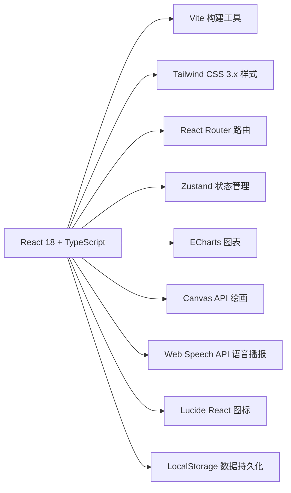

## 1. 架构设计



## 2. 技术说明

- 前端框架: React@18 + TypeScript
- 构建工具: Vite@5
- 样式方案: Tailwind CSS@3
- 路由管理: React Router DOM@6
- 状态管理: Zustand
- 图表库: ECharts@5 + echarts-for-react
- 图标库: lucide-react
- 语音播报: Web Speech API (浏览器原生)
- 绘画: Canvas API (浏览器原生)
- 数据持久化: LocalStorage

## 3. 路由定义

| 路由 | 页面 | 说明 |
|-------|------|------|
| / | Home | 首页导航 |
| /emotion-cards | EmotionCards | 情绪卡片 |
| /situations | Situations | 情境模拟 |
| /emotion-wheel | EmotionWheel | 情绪选择轮 |
| /breathing | BreathingExercise | 呼吸练习 |
| /diary | MoodDiary | 心情日记 |
| /parent-dashboard | ParentDashboard | 家长看板 |

## 4. 数据模型

### 4.1 情绪数据模型

```typescript
interface Emotion {
  id: string;
  name: string;
  emoji: string;
  color: string;
  bgColor: string;
  tips: string;
  copingMethods: { icon: string; text: string }[];
}
```

### 4.2 场景数据模型

```typescript
interface Situation {
  id: string;
  title: string;
  image: string;
  description: string;
  correctEmotions: string[];
  knowledge: string;
}
```

### 4.3 心情日记记录

```typescript
interface DiaryEntry {
  date: string;
  emotionId: string;
  drawing: string; // base64
  note: string;
}
```

### 4.4 呼吸练习数据

```typescript
interface BreathingStats {
  totalStars: number;
  completedSessions: number;
}
```
